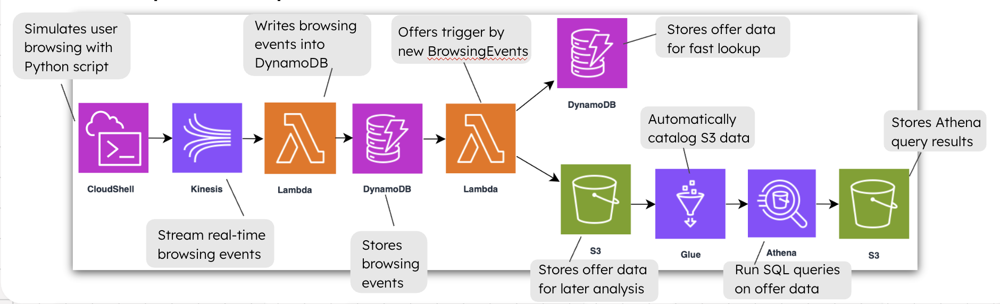

# 📦 AWS Marketing Offers Pipeline

This project implements a real-time, serverless data pipeline using AWS services. It simulates user browsing behavior, processes events in real-time, and stores transformed data in an S3-backed data lake that can be queried using Athena.

---

## 🚀 Architecture Overview



## 📂 Project Structure

aws-marketing-offers-pipeline/
├── infrastructure/         # Terraform code for provisioning AWS resources
├── src/                    # Lambda function code and simulator script
│   ├── IngestorLambda.py
│   ├── OfferGeneratorLambda.py
│   └── browsing_simulator.py
├── presentation/           # PowerPoint slides and architecture diagrams
│   └── architecture-diagram.png
├── Makefile                 # Deployment automation
├── .gitignore
└── README.md

## 🛠️ Tools & Services Used

- AWS Kinesis — Stream real-time browsing events
- AWS Lambda — Serverless event processors
- AWS DynamoDB — Fast NoSQL database with Streams
- AWS S3 — Storage for transformed offer data
- AWS Glue Crawler — Auto-schema discovery
- AWS Athena — Query data lake using SQL
- Terraform — Infrastructure as Code
- Python + boto3 — Event simulation

## 🧪 Step-by-Step Setup Instructions

1. ✅ Configure AWS CLI

```bash
aws configure
```

You will be prompted to enter the following:

| Field                 | Where to Get It                                                                 |
|-----------------------|----------------------------------------------------------------------------------|
| AWS Access Key ID     | [IAM Console → Users → Security credentials tab](https://console.aws.amazon.com/iam/) |
| AWS Secret Access Key | Generated when you create the Access Key (download immediately)                |
| Default region name   | Example: `us-east-1` (choose your preferred region)                             |
| Default output format | Optional. You can use `json`, `table`, or leave blank                           |

If using temporary credentials (e.g. Learner Lab), also:

```bash
export AWS_SESSION_TOKEN="your-session-token"
```

⚠️ Without these credentials, Terraform and Python scripts will fail with errors like:
`The security token included in the request is invalid` or `UnrecognizedClientException`.

2. ✅ Create a Virtual Environment (to avoid dependency issues)

We strongly recommend creating a virtual environment for Python to avoid dependency conflicts with your system Python (especially on macOS with Homebrew):

```bash
python3 -m venv venv
source venv/bin/activate
pip install boto3 pandas
```

Why this matters:
- Keeps your Python packages isolated to the project
- Avoids errors like ModuleNotFoundError: No module named 'boto3' even after installation
- Prevents conflicts with Homebrew-protected environments (PEP 668)

✅ Once the environment is activated, you can run the simulator confidently and install packages safely.

3. ✅ Set Up terraform.tfvars
Inside the `infrastructure/` folder, create a file named `terraform.tfvars`:

```bash
bucket_name = "real-time-offers-archive-<unique-identifier>"
lambda_role_arn = "arn:aws:iam::<account-id>:role/YourLambdaExecutionRole"
```
This provides the IAM role ARN that your Lambda functions will assume.

📍 Where to Get the IAM Role ARN
1. Go to the IAM Console
2. Click on Roles
3. Find the role you created for Lambda (or create a new one with AWSLambdaBasicExecutionRole)
4. Click it → Copy the Role ARN
5. Paste into your terraform.tfvars

❗ Make sure the role allows:
- logs:CreateLogGroup, logs:PutLogEvents
- kinesis:GetRecords, dynamodb:StreamRead
- s3:PutObject, etc. as needed

4. ✅ Deploy Using Makefile

From the project root:

```bash
make deploy
```

This will:
- Install Python dependencies
- Initialize and apply Terraform
- Wait 60 seconds for AWS services to stabilize
- Start sending events from the simulator

5. ✅ Clean Up When Done

To destroy all provisioned resources:

```bash
make destroy
```

If you encounter errors:
- Stop the Glue crawler manually
- Empty the S3 bucket on the AWS Management Console

## ⚠ Troubleshooting Guide

| Problem                                         | Fix                                                                 |
|-------------------------------------------------|----------------------------------------------------------------------|
| `ModuleNotFoundError: boto3`                   | Activate virtual environment, then `pip install boto3 pandas`       |
| `Runtime.HandlerNotFound`                      | Ensure the handler name matches both the filename and function name |
| `AccessDeniedException` on destroy             | Stop the Glue crawler, or wait for it to finish                     |
| `BucketNotEmpty` S3 error                      | Manually empty the S3 bucket, or set `force_destroy = true`         |
| `UnrecognizedClientException` / Invalid token  | Refresh AWS credentials and export the `AWS_SESSION_TOKEN`          |
| Terraform errors on Learner Lab                | Restart session and re-run `aws configure`                          |

## 👨‍💻 Author

Built by Mmesoma Udensi


## 📄 License

MIT License